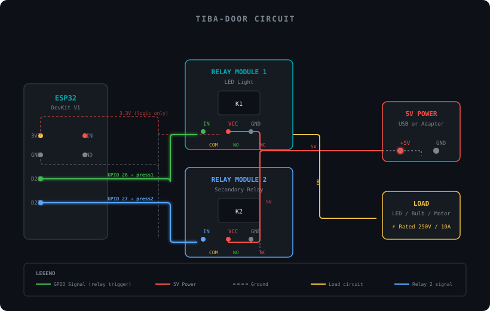

<div align="center">

# Tiba Door

### ESP32 Cloud Command Center

Control ESP32 relays remotely through Firebase Realtime Database.

[](https://github.com/ammar0xff/TIBA-DOOR/actions/workflows/ci.yml)


</div>

---

## What is this?

A web dashboard that sends commands to ESP32 microcontrollers via Firebase Realtime Database. Click a button on the web, the ESP32 activates a relay — simple as that.

```
Web Dashboard  →  Firebase RTDB  →  ESP32 subscribes  →  Relay ON/OFF
```

## Quick Start

### 1. Clone and install

```bash
git clone https://github.com/ammar0xff/TIBA-DOOR.git
cd TIBA-DOOR
npm install
```

### 2. Configure Firebase

```bash
cp .env.example .env.local
```

Edit `.env.local` with your Firebase project credentials:

```
VITE_FIREBASE_API_KEY=your_api_key
VITE_FIREBASE_DATABASE_URL=https://your-project-default-rtdb.firebaseio.com
VITE_FIREBASE_PROJECT_ID=your_project_id
```

### 3. Run

```bash
npm run dev
```

Open **http://localhost:5173** — click a button, the ESP32 relay activates.

## Circuit Diagram



### Control wiring (logic side)

| ESP32 Pin | Component | Signal |
|-----------|-----------|--------|
| GPIO 26   | R1 → Q1 base   | Relay 1 trigger (`press1`) |
| GPIO 27   | R2 → Q2 base   | Relay 2 trigger (`press2`) |
| GND       | Q1/Q2 emitter | Ground rail |
| 5V (VIN)  | K1/K2 coil, D1/D2 | 5V power rail |

### Power / output wiring (load side)

| From | To | Note |
|------|----|------|
| AC Live | Relay COM (both) | switched wire |
| Relay NO | Load (L1, L2) | load returns to Neutral |
| Hi-Link HLK-PM01 | 5V bus + GND | isolated AC-DC supply |
| F1 (1A) | between 5V & VIN | fuse protection |

### Production component notes

- **Relays** — Songle `SRD-05VDC-SL-C`: 5V coil, SPDT, rated **10A @ 250VAC**. Use the **NO** contact to switch the live wire only; never switch neutral.
- **Transistors** — `2N2222A` NPN: the ESP32's 3.3V GPIO **cannot** drive a 5V relay coil directly. The transistor inverts/switches the ~72mA coil current; coil resistance ~70Ω.
- **Flyback diodes** — `1N4007` **across the coil** (cathode to 5V, anode to collector) — required to clamp the inductive spike when the coil de-energizes, otherwise Q1/Q2 die instantly.
- **Base resistors** — `1kΩ` limit GPIO current to ~2.3mA (safe for the ESP32's ~40mA max per pin). Confirms the 5V logic level.
- **Power supply** — Hi-Link `HLK-PM01` (AC 85–265V → 5V DC, isolated). Do **not** power relays from the ESP32's on-board 3.3V regulator — it cannot source the coil current.
- **Decoupling** — `470µF` electrolytic bulk + `0.1µF` ceramic on the 5V rail to absorb coil switching transients and prevent brownouts.

## ESP32 Setup

Install the Firebase Arduino library on your ESP32 and subscribe to the relay paths:

```cpp
#include <Firebase_ESP_Client.h>

// Firebase config
#define FIREBASE_HOST "your-project-default-rtdb.firebaseio.com"
#define FIREBASE_AUTH "your_database_secret"

FirebaseData fbdo;

void setup() {
  Firebase.begin(FIREBASE_HOST, FIREBASE_AUTH);
  Firebase.setStreamCallback(fbdo, streamCallback, streamTimeoutCallback);

  // Listen for relay commands
  Firebase.RTDB.beginStream(&fbdo, "/press1");
  Firebase.RTDB.beginStream(&fbdo, "/press2");
}

void loop() {
  // Firebase stream runs in background
}

void streamCallback(StreamData data) {
  String path = data.dataPath();
  int value = data.intData();

  if (value == 1) {
    if (path == "/press1") {
      digitalWrite(RELAY_1_PIN, HIGH);
      delay(500);
      digitalWrite(RELAY_1_PIN, LOW);
    }
    if (path == "/press2") {
      digitalWrite(RELAY_2_PIN, HIGH);
      delay(500);
      digitalWrite(RELAY_2_PIN, LOW);
    }
    // Reset the command in Firebase
    Firebase.RTDB.setInt(&fbdo, path.c_str(), 0);
  }
}
```

## Adding More Relays

Edit `src/main.ts` and add a new entry to the `RELAYS` array:

```typescript
const RELAYS: Relay[] = [
  { id: 1, label: "Relay 1", description: "LED light control", path: "press1" },
  { id: 2, label: "Relay 2", description: "Secondary relay", path: "press2" },
  { id: 3, label: "Relay 3", description: "Door lock", path: "press3" },
]
```

The dashboard automatically renders cards for all relays in the array.

## Commands

| Command | Description |
|---|---|
| `npm run dev` | Start dev server |
| `npm run build` | Production build to `dist/` |
| `npm run preview` | Preview production build |
| `npm run type-check` | TypeScript type checking |

## Tech Stack

| | |
|---|---|
| Build | Vite 6 |
| Language | TypeScript 5 |
| Firebase | v11 (modular SDK) |
| Hosting | GitHub Pages |

## License

[MIT](./LICENSE)
